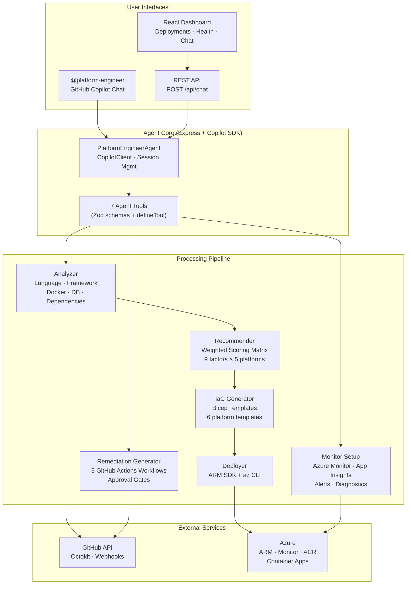

# Platform Engineer Agent 🏗️

> **An AI agent that deploys your code to Azure — just point it at a repo and chat.**

An agentic platform engineer powered by the [GitHub Copilot SDK](https://github.com/github/copilot-sdk) that analyzes any GitHub repository, recommends the optimal Azure hosting platform, deploys with generated Bicep infrastructure-as-code, sets up monitoring, and auto-remediates production issues — all through natural language conversation.

Built for the **FY26 GitHub Copilot SDK Challenge**.

---

## Highlights

- 🔍 **Deep Repo Analysis** — Detects languages, frameworks, Dockerfiles, databases, and architecture patterns
- 🧮 **Smart Recommendations** — Weighted scoring matrix evaluates 9 factors across 5 Azure platforms
- 🏗️ **Generates IaC** — Produces Bicep templates tailored to the app and chosen platform
- 🚀 **One-Command Deploy** — Provisions Azure resources via ARM SDK + Azure CLI
- 📊 **Built-in Monitoring** — Azure Monitor alerts, Application Insights, and diagnostics
- 🔧 **Auto-Remediation** — GitHub Actions workflows for health checks, drift detection, security scanning, and self-healing with approval gates
- 💬 **Conversational UX** — Powered by GitHub Copilot SDK with 7 agent tools
- 🖥️ **Web Dashboard** — React SPA showing deployments, health, and a chat interface

---

## Demo Conversation

```
You:  Analyze and deploy https://github.com/contoso/fastapi-app
Agent: 🔍 Analyzing repository...
       Detected Python 3.11, FastAPI, PostgreSQL, Dockerfile present.

       📊 Platform Recommendations:
       1. Container Apps — 87/100 (containerized, HTTP API, auto-scale)
       2. App Service     — 72/100
       3. Functions        — 45/100

       Shall I deploy to Container Apps in eastus2?
You:  Yes, go ahead
Agent: ✅ Deployed to rg-fastapi-app-prod
       📈 Monitoring configured (CPU, memory, restart alerts)
       🔧 5 GitHub Actions workflows installed for auto-remediation
```

---

## Architecture



### Request Flow

```
Install GitHub App → @platform-engineer in chat → Agent analyzes repo
→ Recommends platform → User approves → Generates Bicep → Deploys to Azure
→ Sets up monitoring → Installs GitHub Actions workflows → Continuous monitoring loop
→ Auto-remediation on failure (with approval for destructive operations)
```

---

## Tech Stack

| Layer | Technology |
|-------|-----------|
| **Runtime** | TypeScript, Node.js 22, Express 5 |
| **AI** | GitHub Copilot SDK (`@github/copilot-sdk`) |
| **Validation** | Zod v4 |
| **Cloud** | Azure ARM SDKs, Azure CLI, Bicep |
| **GitHub** | Octokit, GitHub App webhooks, GitHub Actions |
| **Frontend** | React 19, Vite 6, React Router 7 |
| **Deployment** | Docker (multi-stage), Azure Developer CLI (`azd`) |
| **Testing** | Vitest |

---

## Quick Start

### Prerequisites

- **Node.js 22+**
- **Azure CLI** (`az`) with an authenticated session
- **GitHub Token** — personal access token with `repo` and `copilot` scopes
- **GitHub Copilot** subscription

### Install & Run Locally

```bash
git clone https://github.com/canayorachu/platform-engineer-agent.git
cd platform-engineer-agent

# Install dependencies
npm install
cd web && npm install && cd ..

# Configure environment
cp .env.example .env
# Edit .env with your credentials

# Build the web dashboard
cd web && npm run build && cd ..

# Start in development mode
npm run dev
```

The server starts at `http://localhost:3000`:

| Endpoint | Description |
|----------|-------------|
| `/` | React dashboard (Deployments, Health, Chat) |
| `POST /api/chat` | Conversational agent API |
| `GET /api/deployments` | List tracked deployments |
| `POST /api/webhook` | GitHub App webhook receiver |
| `GET /health` | Health check |

### Environment Variables

| Variable | Required | Description |
|---|---|---|
| `GITHUB_TOKEN` | Yes | PAT with `repo` + `copilot` scopes |
| `GITHUB_APP_ID` | For webhooks | GitHub App ID |
| `GITHUB_APP_PRIVATE_KEY_PATH` | For webhooks | Path to `.pem` private key |
| `GITHUB_WEBHOOK_SECRET` | For webhooks | Webhook HMAC secret |
| `AZURE_TENANT_ID` | For deploy | Azure AD tenant ID |
| `AZURE_CLIENT_ID` | For deploy | Service principal / managed identity client ID |
| `AZURE_CLIENT_SECRET` | For deploy | Service principal secret (or use managed identity) |
| `COPILOT_MODEL` | No | Model override (default: `gpt-4o`) |
| `PORT` | No | Server port (default: `3000`) |

## Project Structure

```
├── src/
│   ├── index.ts                 # Express server entry point
│   ├── config.ts                # Environment variable loading
│   ├── agent/
│   │   ├── agent.ts             # CopilotClient wrapper + session management
│   │   ├── tools.ts             # 7 agent tools wired to all modules
│   │   ├── system-prompt.ts     # Platform engineer persona
│   │   ├── analyzer.ts          # Repository analysis engine
│   │   ├── recommender.ts       # Weighted scoring matrix (9 factors, 5 platforms)
│   │   ├── store.ts             # In-memory deployment tracking
│   │   └── types.ts             # Analysis report types
│   ├── auth/
│   │   └── webhook.ts           # HMAC-SHA256 signature verification
│   ├── azure/
│   │   └── deployer.ts          # Azure deployment via ARM SDK + az CLI
│   ├── github/
│   │   ├── client.ts            # Octokit wrapper (tree API, file fetching)
│   │   ├── webhook-handler.ts   # GitHub App event handling
│   │   └── remediation.ts       # GitHub Actions workflow generator
│   ├── infra-gen/
│   │   ├── generator.ts         # Bicep template rendering engine
│   │   └── templates/           # 6 platform-specific Bicep templates
│   │       ├── common/          # Shared monitoring infra
│   │       ├── functions/       # Azure Functions
│   │       ├── app-service/     # App Service
│   │       ├── container-apps/  # Container Apps
│   │       ├── aks/             # AKS
│   │       └── vm/              # Virtual Machines
│   └── monitoring/
│       └── monitor.ts           # Azure Monitor alert + diagnostic setup
├── web/                         # React dashboard (Vite)
│   └── src/
│       ├── pages/               # Dashboard, Deployments, Chat pages
│       └── components/          # StatusBadge, etc.
├── infra/
│   └── main.bicep               # Agent's own hosting infrastructure
├── Dockerfile                   # Multi-stage build (server + web)
├── azure.yaml                   # Azure Developer CLI config
└── .github/
    └── workflows/               # CI/CD pipeline
```

## Agent Tools

The agent exposes 7 tools through the Copilot SDK:

| Tool | Purpose |
|---|---|
| `analyze_repo` | Analyze a GitHub repository structure, language, framework, and dependencies |
| `recommend_platform` | Score and rank Azure platforms using a weighted matrix |
| `generate_infra` | Generate Bicep templates for the chosen platform |
| `deploy` | Deploy to Azure using generated infrastructure |
| `setup_monitoring` | Configure Azure Monitor alerts and diagnostics |
| `setup_remediation` | Generate GitHub Actions workflows for auto-remediation |
| `check_deployment_status` | Query deployment health and active alerts |

## Platform Scoring Matrix

The recommender evaluates 9 weighted factors:

| Factor | Weight | What It Measures |
|---|---|---|
| Event-driven / triggers | 1.0 | Queue/timer/event trigger patterns |
| Already containerized | 1.2 | Dockerfile presence and complexity |
| Microservices | 1.0 | Multi-service architecture signals |
| Complexity | 1.0 | Code size, dependency count, services |
| Scaling needs | 0.8 | Concurrency, traffic patterns |
| Database requirements | 0.6 | Database type and managed service fit |
| Cost sensitivity | 0.8 | Consumption vs. dedicated pricing fit |
| Team size / ops | 0.6 | Operational complexity tolerance |
| Compliance / isolation | 0.4 | Network isolation, dedicated compute |

---

## Deploy the Agent to Azure

### With Azure Developer CLI (recommended)

```bash
az login
azd auth login
azd up
```

This provisions:
- **Azure Container Registry** (Basic) — stores the Docker image
- **Container Apps Environment** — serverless container hosting with Log Analytics
- **Application Insights** — telemetry and distributed tracing
- **Managed Identity** — with ACR Pull role (zero secrets)
- **Auto-scaling** — 1–5 replicas based on HTTP concurrency

### With Docker

```bash
docker build -t platform-engineer-agent .
docker run -p 3000:3000 --env-file .env platform-engineer-agent
```

---

## Generated Remediation Workflows

When the agent sets up auto-remediation for a target repo, it generates these GitHub Actions workflows:

| Workflow | Schedule | Purpose |
|---|---|---|
| **Health Check** | Every 5 min | Endpoint health + Azure resource status |
| **Cost Report** | Weekly | Cost summary posted as GitHub Issue |
| **Drift Detection** | Daily | Bicep `what-if` to detect config drift |
| **Security Scan** | Weekly | Dependency + container vulnerability scan |
| **Auto-Remediate** | On failure | Restart/scale with approval gates |

---

## Scripts

```bash
npm run dev       # Start with hot-reload (tsx watch)
npm run build     # Compile TypeScript
npm start         # Run production build
npm test          # Run vitest suite
```

---

## Contributing

1. Fork the repo
2. Create a feature branch (`git checkout -b feature/amazing-thing`)
3. Commit changes (`git commit -m 'Add amazing thing'`)
4. Push to the branch (`git push origin feature/amazing-thing`)
5. Open a Pull Request

---

## License

ISC
